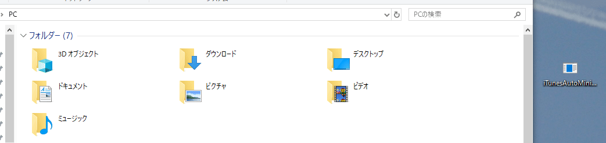

# iTunesAutoMinimized

iTunes の画面を自動で最小化します。

## 使い方

1. [Releases](https://github.com/book000/iTunesAutoMinimized/releases)から `iTunesAutoMinimized.exe` をダウンロードします。
2. `%APPDATA%\Microsoft\Windows\Start Menu\Programs\Startup`にアクセスし、ダウンロードした iTunesAutoMinimized.exe をコピー・ペーストします。
3. おわり。

## ライセンス

当アプリケーションには[MIT License](https://github.com/book000/iTunesAutoMinimized/blob/master/LICENSE)を適用します。

## 免責事項

作者(Tomachi)は、当アプリケーションを利用したことによる如何なる問題に対して責任を負いません。
